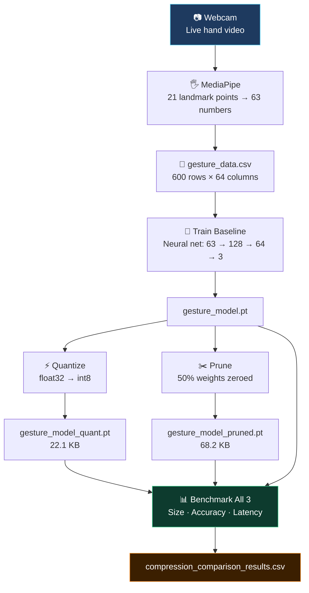

TINYML GESTURE BASED PROJECT

**Compression, Measured.**
*Train it. Shrink it. Benchmark it. Know exactly what you lost — and what you didn't.*

[](https://python.org/)
[](https://pytorch.org/)
[](https://mediapipe.dev/)
[](https://opencv.org/)
[](https://scikit-learn.org/)

[](LICENSE)
[]()
[]()

[📊 See Results](#-results) • [🚀 Quick Start](#-quick-start) • [🗺️ Pipeline](#️-the-pipeline)

---

## ⚡ The Problem This Project Solves

ML models are built on powerful machines — GPUs, cloud servers, unlimited RAM. But the real world runs on hearing aids, wearables, sensors, and microcontrollers. A model that works perfectly in the cloud is often too large and too slow to deploy on a constrained device.

This project directly answers one question:

> **"Which compression technique gives the best accuracy-per-size tradeoff for a real-time task running entirely on-device?"**

| ❌ Typical ML Project | ✅ This Project |
|---|---|
| Trains a model, reports accuracy, stops there | Trains a model then systematically shrinks it |
| No size or speed measurement | Measures size (KB), accuracy (%), and latency (ms) |
| Needs cloud or GPU | Runs entirely on a laptop CPU |
| Compression is theoretical | Compression is applied, measured, and compared |
| Results are qualitative | Results are a CSV table with real numbers |

---

## 🎬 What It Does

A webcam-based system that recognizes three hand gestures in real time — **open palm**, **fist**, and **thumbs up** — using hand landmark coordinates from MediaPipe. A small neural network classifies the gesture. Then that same network is compressed two ways, and all three versions are benchmarked head-to-head.

The gesture task is simple by design. The real work is the compression comparison.

---

## 📊 Results

Measured on a held-out test set of 160 samples. All models trained and evaluated on the same laptop CPU.

```
══════════════════════════════════════════════════════════════
Technique                  Size (KB)   Accuracy (%)  Latency (ms)
──────────────────────────────────────────────────────────────
Baseline (float32)             68.2         85.00         0.178
Quantized (int8)               22.1         85.00         1.030
Pruned (50% sparse)            68.2         85.62         0.154
══════════════════════════════════════════════════════════════
```

**Key takeaways:**
- Quantization delivers a **3× size reduction** (68 KB → 22 KB) with **zero accuracy loss**
- Pruning keeps file size the same but produces the **fastest inference** (0.154 ms) and even slightly improved accuracy
- Both techniques are viable — the right choice depends on whether your constraint is storage or speed

---

## 🗺️ The Pipeline

Six scripts. Run them in order. Each one produces files the next one consumes.



| Step | Script | Does | Produces |
|------|--------|------|----------|
| 1 | `1_collect_data.py` | Opens webcam, records 200 frames × 3 gestures | `gesture_data.csv` |
| 2 | `2_train_model.py` | Trains baseline neural network | `gesture_model.pt` |
| 3 | `3_quantize_and_benchmark.py` | Applies int8 dynamic quantization | `gesture_model_quant.pt` |
| 4 | `4_prune.py` | Prunes 50% of weights, fine-tunes | `gesture_model_pruned.pt` |
| 5 | `5_benchmark_all.py` | Evaluates all 3 models, builds table | `compression_comparison_results.csv` |
| 6 *(optional)* | `6_live_inference.py` | Live webcam demo with predictions | — |

---

## 🏗️ Model Architecture

```
Input: 63 features
(21 hand landmarks × x, y, z)
        │
        ▼
┌───────────────┐
│  Linear(128)  │  ← learns which landmark combos matter
│  ReLU         │  ← adds non-linearity
│  Dropout(0.3) │  ← prevents memorization
└───────────────┘
        │
        ▼
┌───────────────┐
│  Linear(64)   │  ← compresses to abstract representation
│  ReLU         │
│  Dropout(0.3) │
└───────────────┘
        │
        ▼
┌───────────────┐
│  Linear(3)    │  ← one score per gesture class
└───────────────┘
        │
        ▼
Output: open_palm / fist / thumbs_up
```

---

## 🔬 Compression Techniques Explained

### ⚡ Quantization — Shrink the Numbers

Every weight in a trained model is a 32-bit float (like `0.38291847`). Quantization rounds all those numbers down to 8-bit integers (like `97`). The model gets ~4× smaller and loads faster — at a potential small cost to accuracy.

```
Before:  [0.38291847, -0.71234123, 0.12938471, ...]   ← float32, 4 bytes each
After:   [49, -91, 16, ...]                            ← int8, 1 byte each
Result:  68.2 KB → 22.1 KB  |  Accuracy: unchanged ✓
```

### ✂️ Pruning — Remove the Useless Connections

A neural network is a web of connections. Many of those connections have weights very close to zero — they contribute almost nothing. Pruning finds those weak connections and sets them to exactly zero, then fine-tunes the surviving connections to compensate.

```
Before pruning:  ●━━━━●━━━━●━━━━●   all connections active
After pruning:   ●    ●━━━━●    ●   50% of connections zeroed
Result:  Same file size  |  Accuracy: 85.62% (slightly improved) ✓
```

> [!NOTE]
> Pruning doesn't reduce file size by itself — the zeros still take space in a `.pt` file. To see size benefits, the sparse model would need to be converted to a format that skips zeros (like TFLite with sparse kernels). File size reduction shows up when you zip the file or deploy to a dedicated sparse runtime.

---

## 📁 Folder Structure

```
gesture_edge/
  requirements.txt                       ← install with: pip install -r requirements.txt
  README.md
  model.py                               ← shared neural network definition
  hand_connections.py                    ← MediaPipe 1.0 skeleton drawing fix
  1_collect_data.py
  2_train_model.py
  3_quantize_and_benchmark.py
  4_prune.py
  5_benchmark_all.py
  6_live_inference.py
  gesture_data.csv                       (auto-generated, Step 1)
  gesture_model.pt                       (auto-generated, Step 2)
  label_encoder_classes.npy             (auto-generated, Step 2)
  X_test.npy / y_test.npy               (auto-generated, Step 2)
  gesture_model_quant.pt                 (auto-generated, Step 3)
  gesture_model_pruned.pt                (auto-generated, Step 4)
  compression_comparison_results.csv     (auto-generated, Step 5)
  hand_landmarker.task                   (auto-downloaded, Step 1)
  gesture_pipeline.ipynb                 ← Google Colab version (Steps 2–5)
```

---

## 🛠️ Tech Stack

| Layer | Tool | Purpose |
|-------|------|---------|
|  | Python 3.x | Only language used |
|  | PyTorch | Model training, quantization, pruning |
|  | MediaPipe 1.0 | Hand landmark detection (pre-trained) |
|  | OpenCV | Webcam capture, frame display |
|  | scikit-learn | Label encoding, train/test split |
|  | pandas + NumPy | Data loading and array operations |

All tools are **free and open-source**. No cloud accounts. No paid APIs. No GPU required.

---

## 🚀 Quick Start

> [!WARNING]
> Step 1 and Step 6 require a webcam and must be run manually in your own terminal — they open a live video window that can't run headlessly.

**1️⃣ Install dependencies**
```bash
pip install -r gesture_edge/requirements.txt
```

**2️⃣ Collect gesture data** *(run manually — needs webcam)*
```bash
python gesture_edge/1_collect_data.py
```
Hold each gesture in front of the camera. Press `S` to start recording, `Q` to quit early.

**3️⃣ Train the baseline model**
```bash
python gesture_edge/2_train_model.py
```

**4️⃣ Quantize**
```bash
python gesture_edge/3_quantize_and_benchmark.py
```

**5️⃣ Prune**
```bash
python gesture_edge/4_prune.py
```

**6️⃣ Benchmark — get the comparison table**
```bash
python gesture_edge/5_benchmark_all.py
```

**7️⃣ Live demo** *(optional — needs webcam)*
```bash
python gesture_edge/6_live_inference.py
```

### ☁️ Prefer Google Colab? (No local Python setup needed)

Upload `gesture_pipeline.ipynb` to [colab.research.google.com](https://colab.research.google.com). When prompted, upload your `gesture_data.csv`. All of Steps 2–5 run in the cloud. The last cell downloads your results back to your laptop.

---

## 🗂️ Files Explained

| File | What it is |
|------|-----------|
| `model.py` | Neural network class (`GestureNet`) + `load_checkpoint()` helper. Shared by all scripts. |
| `hand_connections.py` | Hardcoded list of which landmarks connect for drawing the skeleton. Exists because MediaPipe 1.0 removed this built-in. |
| `gesture_pipeline.ipynb` | Google Colab notebook — full Steps 2–5 in one file, no local install needed. |
| `hand_landmarker.task` | Google's pre-trained hand detection model (~8 MB). Auto-downloaded on first run. |

---

## 📐 Why Only One Language?

Everything is Python. The libraries (PyTorch, OpenCV, MediaPipe) are written in C++ internally for speed, but you interact with all of them through Python. You don't need to know C++ to use this project.

---

## 🗺️ Roadmap

**✅ Phase 1 — Complete**
- [x] Webcam data collection with MediaPipe 1.0 Tasks API
- [x] Baseline neural network training with PyTorch
- [x] Dynamic int8 quantization
- [x] Magnitude-based weight pruning with fine-tuning
- [x] Automated benchmarking (size, accuracy, latency)
- [x] Google Colab notebook for cloud execution
- [x] Live inference demo

**🔄 Phase 2 — Planned**
- [ ] Deploy to Raspberry Pi — measure real on-device latency
- [ ] Add knowledge distillation as a third compression technique
- [ ] Expand to 5+ gestures
- [ ] Convert to TFLite format for microcontroller deployment
- [ ] Data augmentation to improve accuracy beyond 85%

**💡 Phase 3 — Future**
- [ ] ONNX export for cross-platform deployment
- [ ] Structured pruning (remove entire neurons, not just weights)
- [ ] Real-time accuracy/latency comparison across all 3 models simultaneously

---

## 📊 Why This Project Matters

| What It Demonstrates | Why It's Significant |
|---|---|
| Model compression on real data | Not just theory — applied to data you collected yourself |
| Quantitative tradeoff analysis | Numbers, not opinions — size vs accuracy vs speed |
| Edge AI simulation on laptop | Same techniques used in production wearables and IoT |
| Reproducible pipeline | Run the 5 scripts, get the same table every time |
| No specialized hardware needed | Proves edge AI research is accessible to anyone |

---


